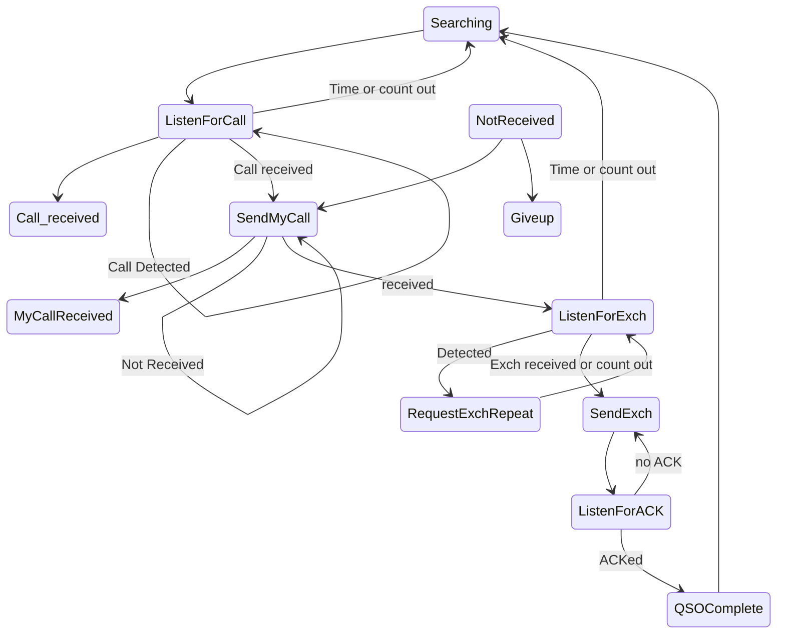

```mermaid

stateDiagram
    Searching --> ListenForCall
    ListenForCall --> Call_received
    ListenForCall --> ListenForCall : Call Detected
    ListenForCall --> Searching : Time or count out
    ListenForCall --> SendMyCall : Call received
    SendMyCall --> MyCallReceived
    SendMyCall --> SendMyCall : Not Received
    SendMyCall --> ListenForExch : received
    NotReceived --> SendMyCall
    NotReceived --> Giveup
    ListenForExch --> RequestExchRepeat: Detected
    RequestExchRepeat --> ListenForExch
    ListenForExch --> Searching : Time or count out
    ListenForExch --> SendExch : Exch received or count out
    SendExch --> ListenForACK
    ListenForACK --> QSOComplete : ACKed
    ListenForACK --> SendExch : no ACK
    QSOComplete --> Searching

```